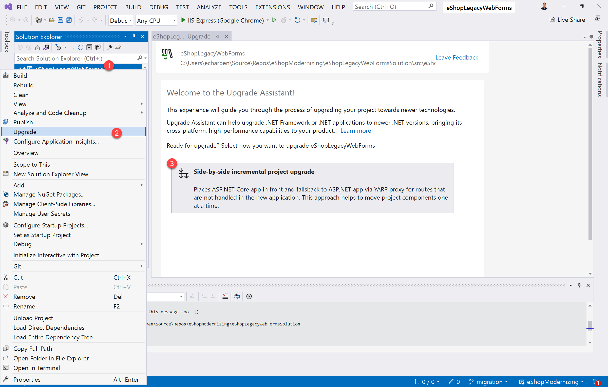
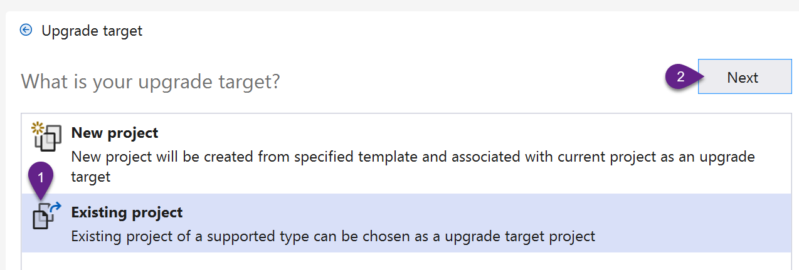
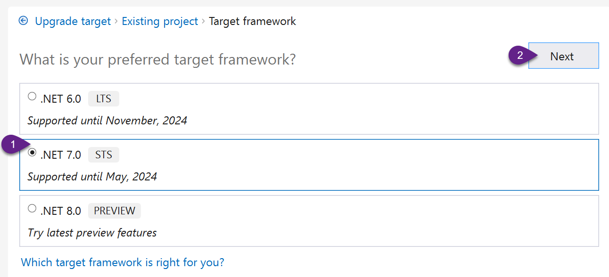
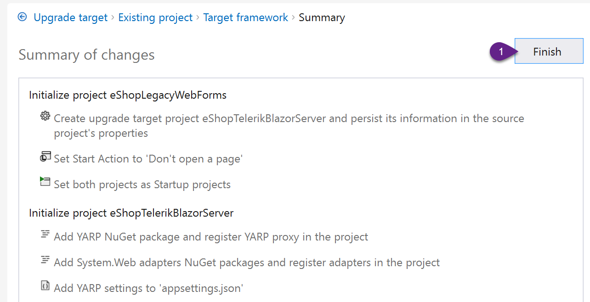
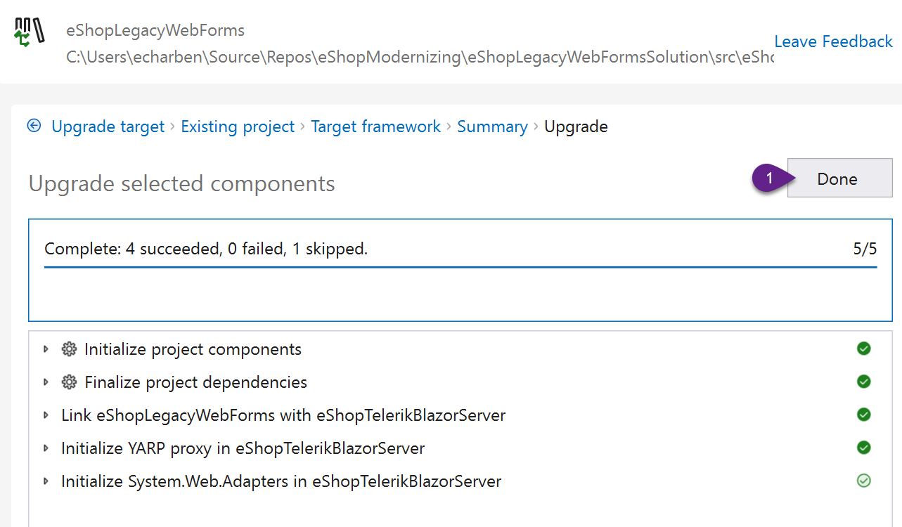
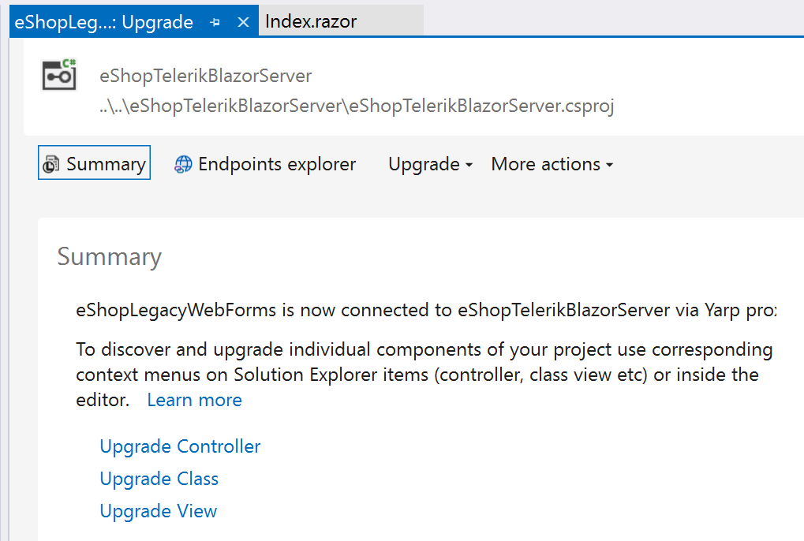
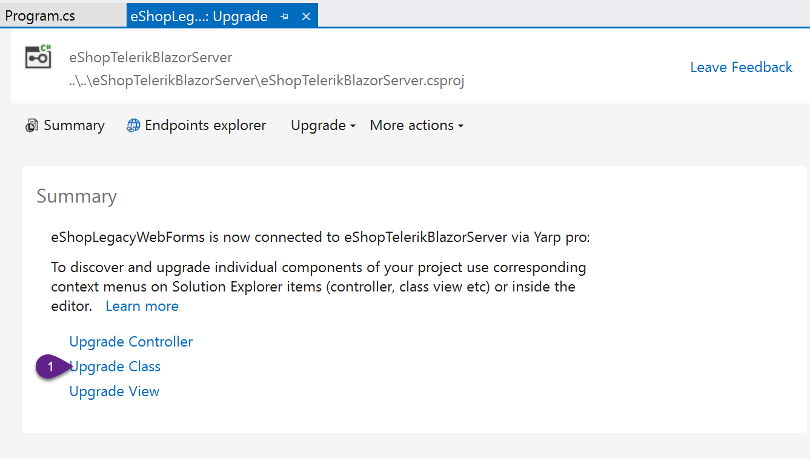
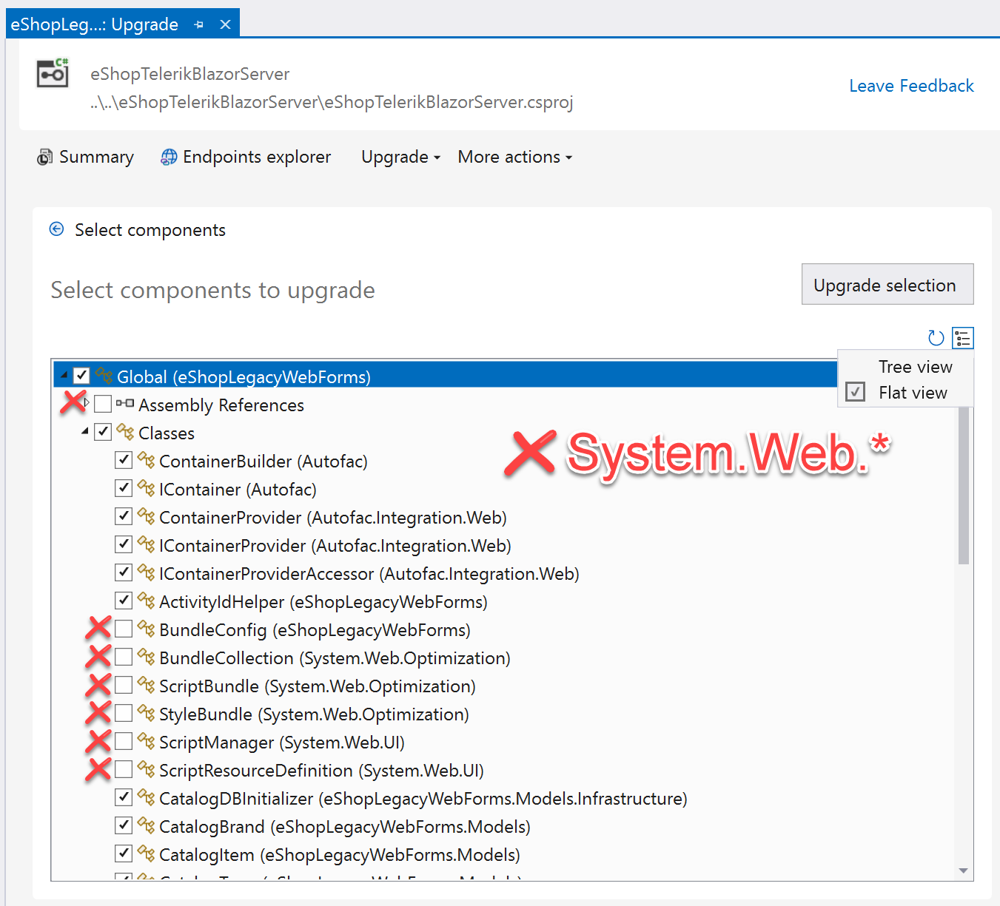
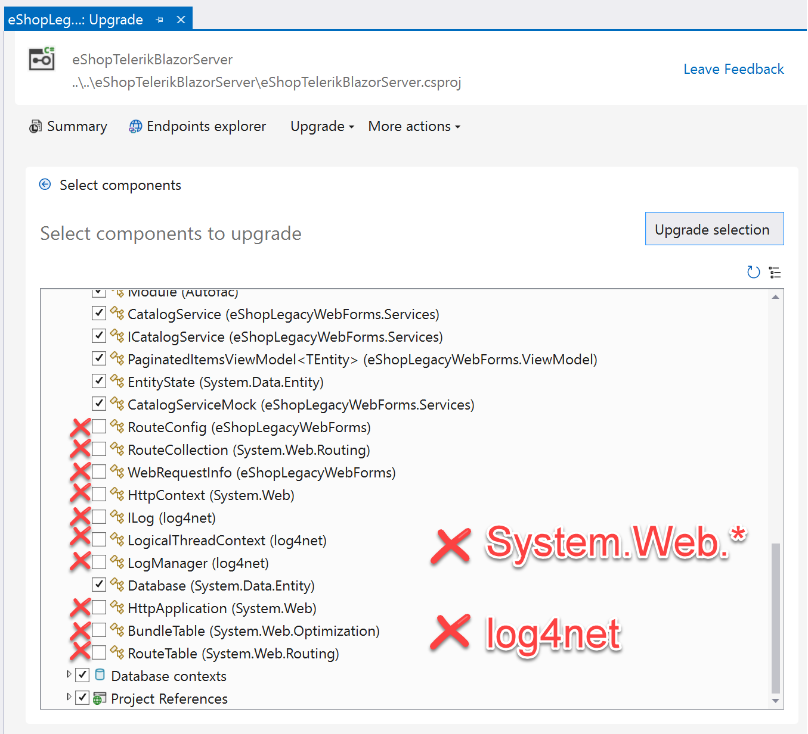
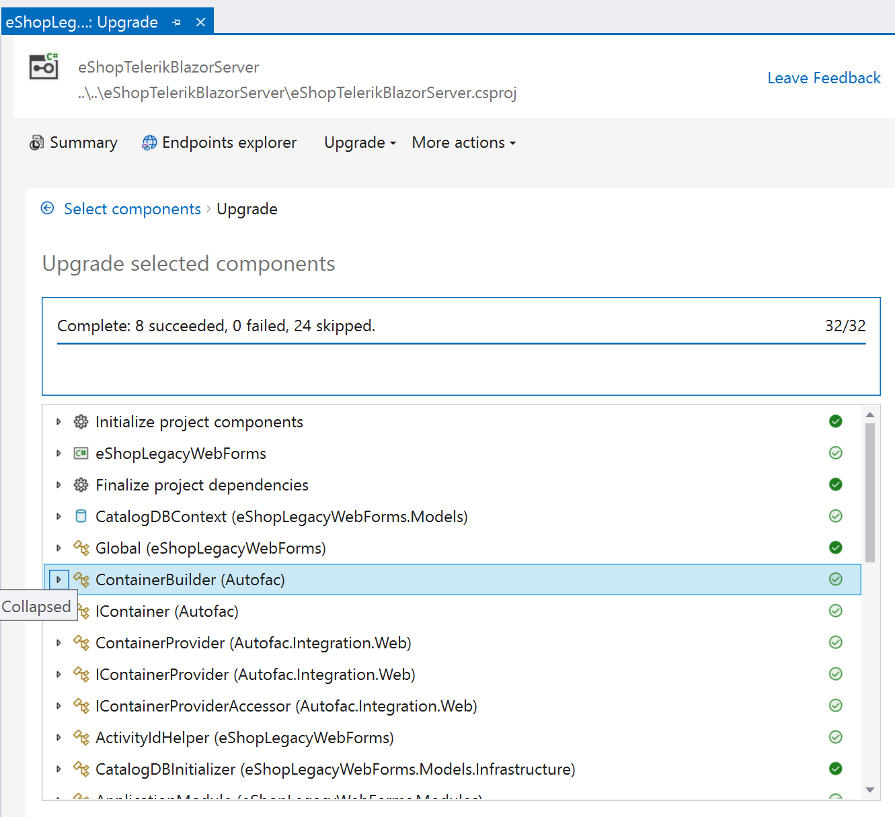

# Assisted Migration

In this section we'll use the **.NET Upgrade Assistant** to prepare the project and start the migration process. The .NET Upgrade Assistant is a **Visual Studio extension** and command-line tool that's designed to assist with upgrading apps to the latest version of .NET. The .NET Upgrade Assistant is not fully automated, however it does shorten the amount of manual coding necessary to complete a migration.

1. Use the **.NET Upgrade Assistant** to **Upgrade** the **eShopLegacyWebForms** project. 

    * Start the upgrade process by right clicking on the **eShopLegacyWebForms** project. Then, choose **Upgrade** from the context menu. Then, select **Side-by-side** from the wizard in the main window.

    
    
    * For the **Upgrade Target** choose **Existing project**. Then select **eShopTelerikBlazorServer** from the Existing project drop down.
    
    
   
    * Next select **.NET 7**. At the time of writing this is the current version.

    

    * The Summary of Changes page should now be displayed explaining the upgrade process and action items.
    
    {: .note-title }
    The summary includes YARP proxies which are not used in this exercise. If this were a ASP.NET MVC or Web API application the YARP proxies would be important steps in the process. I this context, the YARP information can be ignored.

    

    * Finally, click **Finish** to begin the upgrade.

    
    
    * Once the upgrade process is complete a Summary page will be displayed. On this page there are additional actions that will help migrate code that was not included in the initial migration process. These actions will be used later in the workshop, this page can be revisited by opening the Upgrade Assistant via the context menu, for now click Done to continue.

    

    {: .note-title }
    > The summary page will attempt to initialize a YARP proxy and Web Adapters. These are typically used in MVC/Web API applications and are not applicable to this scenario.
    
    {: .note-title }
    > The Upgrade Assistant can be opened to the Summary page at any time. To see the Summary page again, right click on the **eShopLegacyWebForms** project. Then, choose Upgrade from the context menu.

2. Remove the unused proxy settings. In this instance, the .NET Upgrade Assistant added 3 unused settings in Program.cs. These settings are generally used when migrating Web API controllers which this project doesn't have. 

    {: .note-title }
    > For some migration projects, starting both projects may be necessary. A side-by-side migration strategy will use both projects by forwarding web APIs from the source project to the target via proxy.  

    * **Find and remove** the following lines from **Program.cs**

    ```csharp
    // -approximate line numbers
    // - 7, 8
    builder.Services.AddSystemWebAdapters();
    builder.Services.AddHttpForwarder();

    // - 35
    app.MapForwarder("/{**catch-all}", app.Configuration["ProxyTo"]).Add(static builder => ((RouteEndpointBuilder)builder).Order = int.MaxValue);

    ```

    * **Remove** the corresponding values in **appsettings.json**. The values will not cause any errors or warnings if they're not removed, but removing them will keep the file tidy.

    ```js
    // approxmiate line numbers 8-10
    ,
      "AllowedHosts": "*",
      "ProxyTo": ""
    ```

3. Use the **.NET Upgrade Assistant** to migrate the models, classes, services from the **eShopLegacyWebForms** project. When using the Upgrade tool on a class, the target class will have its dependencies upgraded with it. For this example, the **Global.asax.cs** file will be used. Because it's the root class of the application, all of the app's dependencies will listed in the upgrade and chosen by default. 

    {: .note-title }
    > Using the Global.asax.cs may be not be productive for all scenarios. For example, in larger applications individual files or features might be better to target for simplicity. 

    * Select the **Upgrade Class** action from the **Summary** screen, or the **Upgrade** menu.

    

    * Choose the **Global** class from the **Classes** drop down and click **Upgrade**.

    

    * The tool will list all dependencies of the selected class. For this example scenario, it will be all the entire application's contents. Because there is no upgrade path for **System.Web**, deselect the **System.Web** items from the list. The classes may be easier organize in **Flat view**, which is enabled on the upper right corner of the interface.

    

    For simplicity this example will not include the migration steps for logging and **log4net**. Deselect the dependencies that use **log4net**. 

    

    * Once the items have been selected/deselected, click the **Upgrade selection** button to continue.

    

## Conclusion

In this section we used the .NET Upgrade Assistant to start the migration process. A side-by-side migration is being used to move the existing application to a completely new code base. The assistant moved all code which is compatible with the new version of ASP.NET including, EntityFramework and database code, data services, classes. 

The new application will not start successfully in its current state and requires additional work before it is stable. In the next section we'll continue the migration process with manual coding. 

* EF
* Services
* ...