## Prerequisites 

<!-- ??? 
```
		<UseRazorSourceGenerator>true</UseRazorSourceGenerator>
		<Nullable>enable</Nullable>
```		
-->
To complete the workshop be sure to install all of the following prerequisite items. All of the items below have free, or free trial options. If you have existing paid licenses of the Visual Studio 2022 or Telerik UI for Blazor please use those and do not reinstall the free versions.

* [Visual Studio 2022 [Any Edition]](https://visualstudio.microsoft.com/downloads/)
* [.NET 7.0.5 or later](https://dotnet.microsoft.com/en-us/download/dotnet/7.0)
* Telerik UI for Blazor [Free Trial or Licensed](https://www.telerik.com/try/ui-for-blazor)
* [.NET Upgrade Assistant for VS 2022 (Preview)](https://marketplace.visualstudio.com/items?itemName=ms-dotnettools.upgradeassistant)
* [eShopModernizing GitHub Repository](https://github.com/dotnet-architecture/eShopModernizing)

## Getting started

1. Clone the [eShop Repository](https://github.com/dotnet-architecture/eShopModernizing) which contains the sample Web Forms application. 

Throughout this workshop we will be migrating the eShop sample application provided by Microsoft via GitHub. If you have not already created a clone of the repository, create one now. This repository contains multiple eShop solutions. For this workshop we will be using the **eShopLegacyWebForms** solution.

2. Open the eShopLegacyWebForms solution and install any missing frameworks. This step may vary from system to system.

After cloning the application, navigate to the solution in Visual Studio. You will see multiple solution files in the repository, choose **eShopLegacyWebForms**. Be aware of any notifications from Visual Studio that might inform you of additional dependencies that will need to be installed. Look for a yellow banner with an **Install** link in the **Solution Explorer**. Click install, follow the prompts and complete the installation as needed.

 Reboot may be necessary

3. Start the eShopLegacyWebForms application. From Visual Studio click **Start** or press **F5**. The sample application is a simple store management page with view, create, edit, and delete functions.

> Troubleshooting tip: If the application does not run on the first try, Start the application a second time. The first time building the project occasionally hits a race condition where resources are not yet ready for the application to run. Running the app a second time typically works.

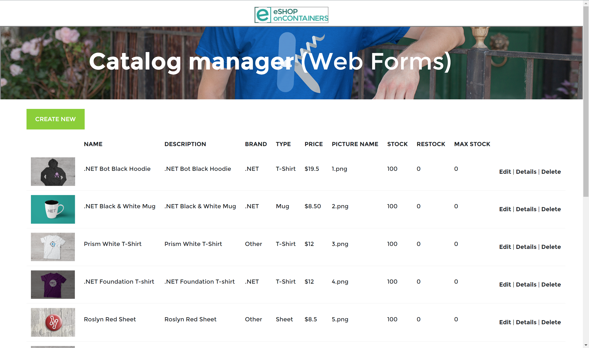

4. After verifying the application starts properly, close the browser or stop the application from Visual Studio.

Take a moment to review the structure of the application and become familiar with its parts.

* **App_Start**, this folder contains the startup routines for the application.
* **Catalog**, this folder contains the Create, Delete, Details, and Edit features for the application.
* **Models**, this folder contains various data models for the application and its database. 
* **Modules**, this folder contains dependency injection (DI) configurations for AutoFac.
* **Services**, this folder contains data services used in the application.
* **ViewModel**, this folder contains a class used as a data projection for the application's main view.

5. Create a branch named `migration`. This branch will contain the migrated application and track changes to the application.

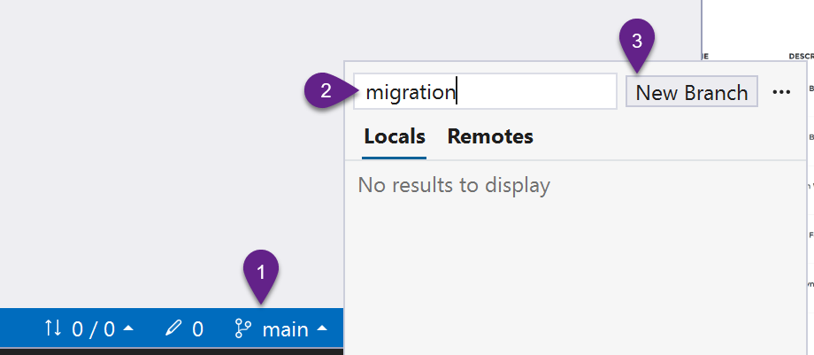

## Creating a new project

Because of the number of differences between .NET Framework and ASP.NET Core, the app will be migrated to a brand new solution. In addition, there is no direct migration path for Web Forms views in ASP.NET Core and the views will need to be completely rewritten. The Telerik UI for Blazor and its templates, scaffolding tools, and components will reduce the amount of coding needed to write new views.

> The Telerik Extensions for Visual Studio are added to Visual Studio when installing Telerik UI for Blazor. If the extension isn't installed, it can be added from the [Visual Studio Marketplace](https://marketplace.visualstudio.com/items?itemName=TelerikInc.ProgressTelerikBlazorVSExtensions), or the Telerik UI for Blazor installer. Important: Telerik UI for Blazor is required to make use of the extension.

1. Create a new Telerik UI for Blazor Server application. This application will be the migration target. To create a Telerik UI for Blazor application in the solution:

* Right click on the root item in the solution, **Solution, eShopLegacyWebForms**.
* Select the **Telerik C# Blazor Application** template.

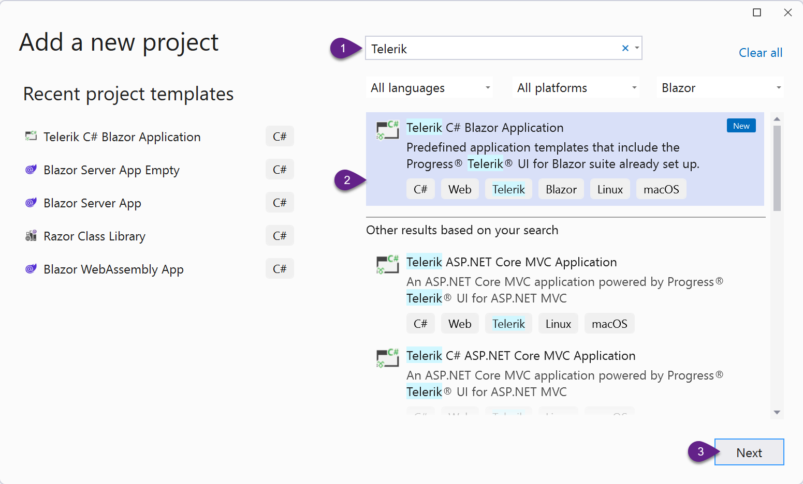

* Name the project **eShopTelerikBlazorServer**.

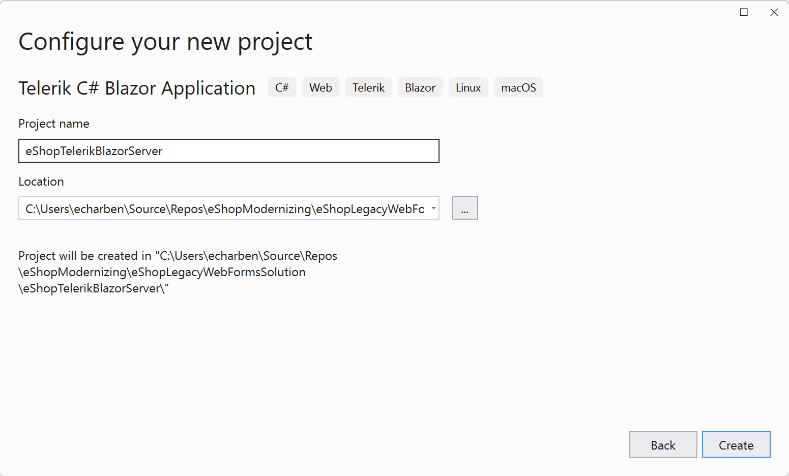

* Select a Telerik theme. The **Default-Ocean-Blue-A11y** is a recommended starting point because the colors have been tested for optimal accessibility. 

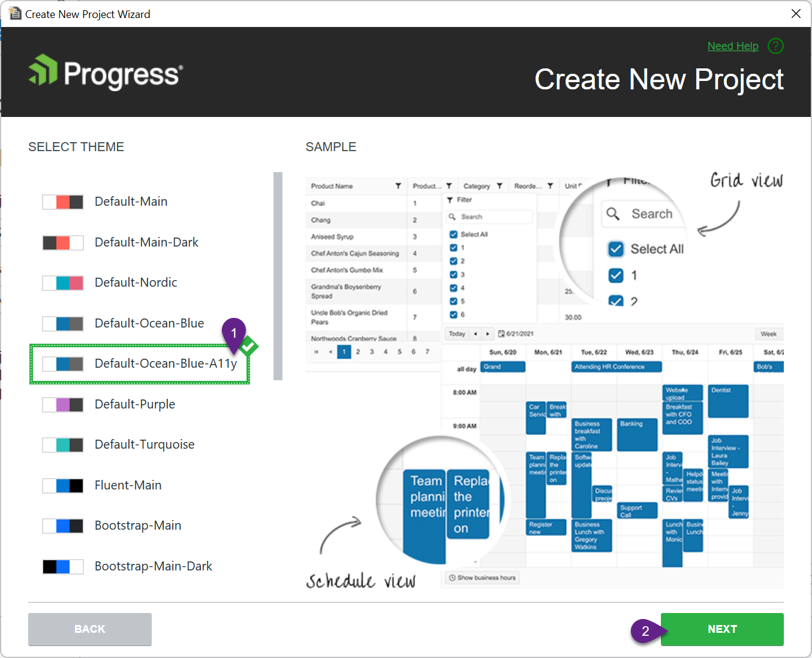

* For the workshop the default project settings will be used. When using Telerik UI for Blazor on projects that require localization, the option can be enabled here and localization resources will be generated. Click finish to generate the new project.

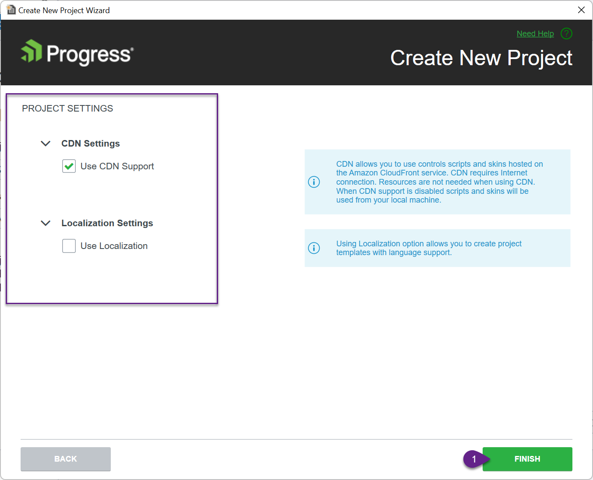

2. Set the startup project to the Blazor Server project,  **eShopTelerikBlazorServer**. Choose **Configure Startup Projects** from the **Project** menu.

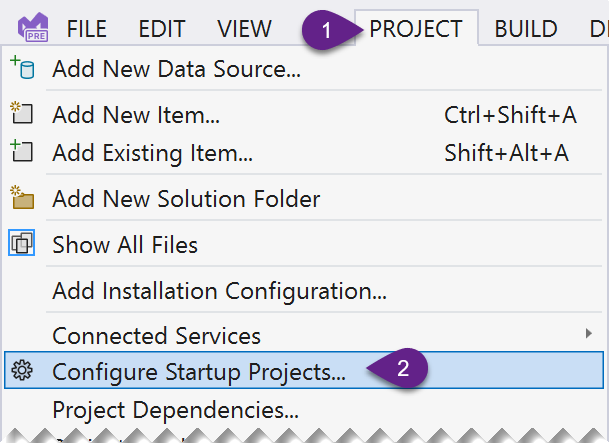

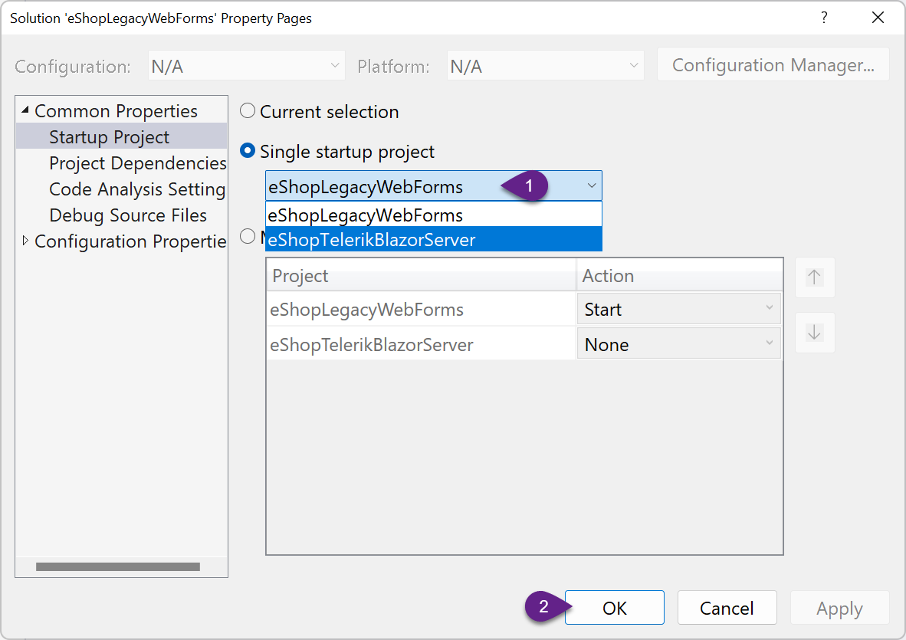

* Select the **eShopTelerikBlazorServer** project from the **Single startup project** option. This menu can be revisited at any time to switch startup projects, or enable multiple startup projects.

3. Start the **eShopTelerikBlazorServer** project by clicking **Start** or pressing **F5**.

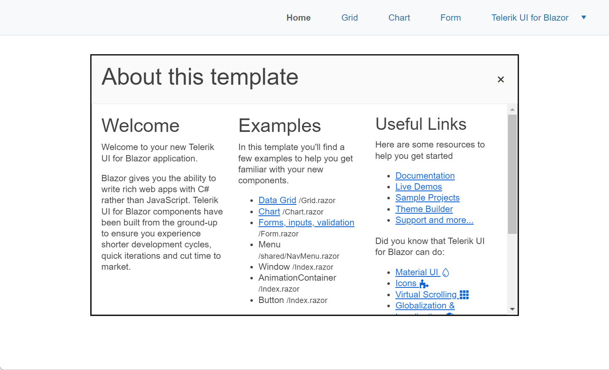

4. Explore the new application to see an example of Telerik UI for Blazor's components and capabilities.

* `/` the root page demonstrates the window component and notification components. The code for this view is located in `Index.razor`.
* `/grid` the grid page displays a sample Telerik Grid component with Create, Read, Update and Delete operations.
* `/chart` the chart page shows one of the many charts available in Telerik UI for Blazor.
* `/form` the form page uses the Telerik Form component and its automatic form generation features.

## Migriate the project

1. Use the **.NET Upgrade Assistant** to **Upgrade** the **eShopLegacyWebForms** project. 

* Start the upgrade process by right clicking on the **eShopLegacyWebForms** project. Then, choose **Upgrade** from the context menu.

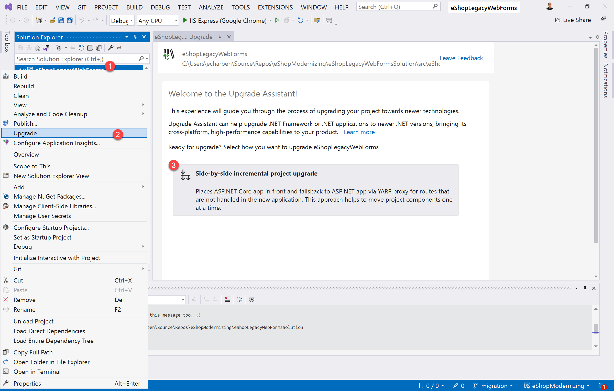

* Select **Side-by-side** from the wizard in the main window.

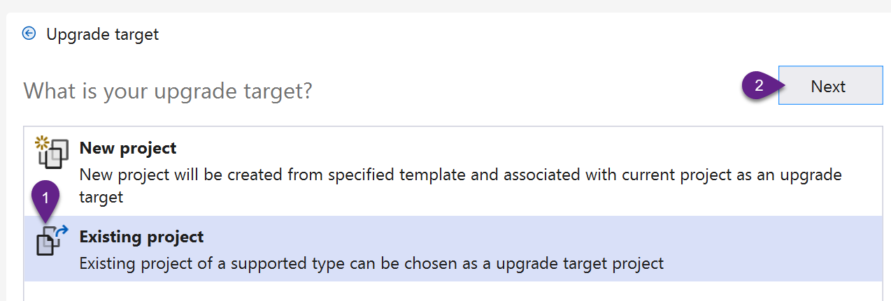

* Then choose, **Existing project**. Then select **eShopTelerikBlazorServer** from the Existing project drop down.

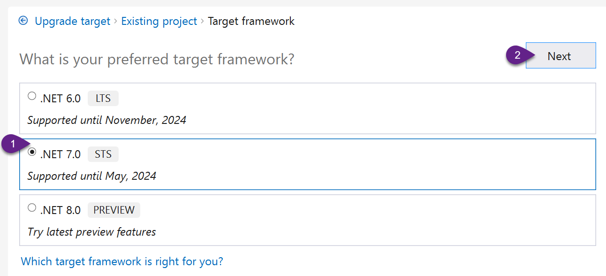

* Next select **.NET 7**. At the time of writing this is the current version.

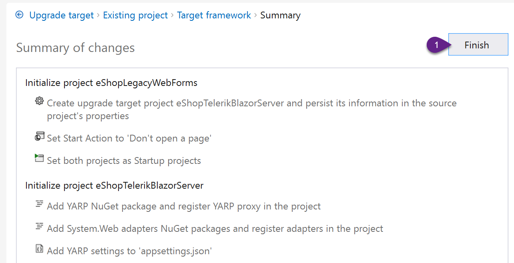

* Finally, click **Finish** to begin the upgrade.

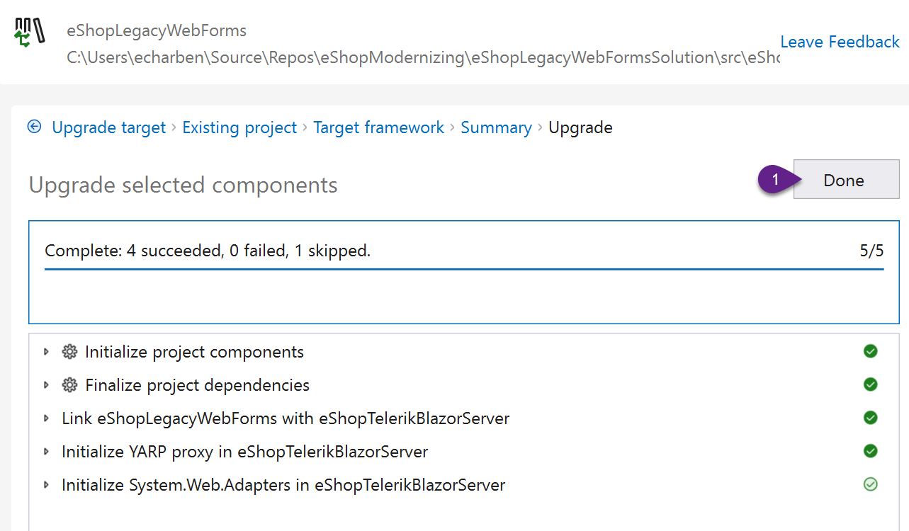

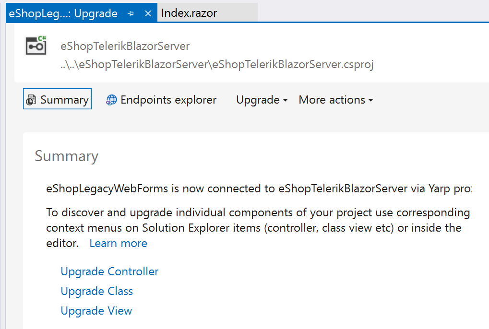

> Note: The summary page will attempt to initialize a YARP proxy and Web Adapters. These are typically used in MVC/Web API applications and are not applicable to this scenario. 

2. Remove the unused proxy settings. In this instance, the .NET Upgrade Assistant added 3 unused settings in Program.cs. These settings are generally used when migrating Web API controllers which this project doesn't have. 

> For some migration projects, starting both projects may be necessary. A side-by-side migration strategy will use both projects by forwarding web APIs from the source project to the target via proxy.  

* Find and remove the following lines from **Program.cs**

```csharp
// -approximate line numbers
// - 7, 8
builder.Services.AddSystemWebAdapters();
builder.Services.AddHttpForwarder();

// - 35
app.MapForwarder("/{**catch-all}", app.Configuration["ProxyTo"]).Add(static builder => ((RouteEndpointBuilder)builder).Order = int.MaxValue);

```

* Remove the corresponding values in `appsettings.json`. The values will not cause any errors or warnings if they're not removed, but removing them will keep the file tidy.

```js
// approxmiate line numbers 8-10
,
  "AllowedHosts": "*",
  "ProxyTo": ""
```

3. Use the **.NET Upgrade Assistant** to migrate the models, classes, services from the **eShopLegacyWebForms** project. When using the Upgrade tool on a class, the target class will have its dependencies upgraded with it. For this example, the **Global.asax.cs** file will be used. Because it's the root class of the application, all of the app's dependencies will listed in the upgrade and chosen by default. 

> Using the Global.asax.cs may be not be productive for all scenarios. For example, in larger applications individual files or features might be better to target for simplicity. 

* Select the **Upgrade Class** link from the **Summary** screen, or the **Upgrade** menu.

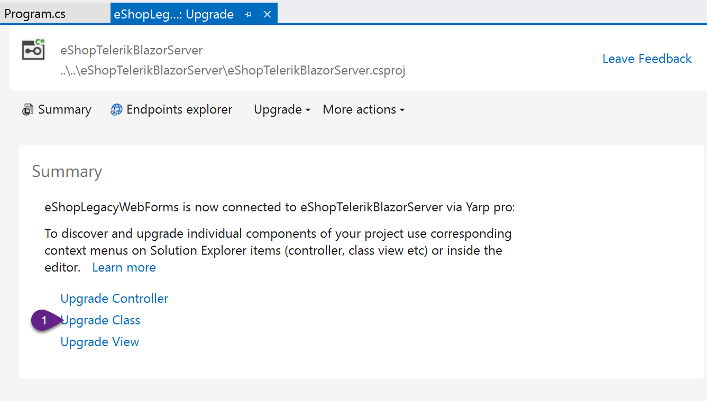

* Choose the **Global** class from the **Classes** drop down and click **Upgrade**.

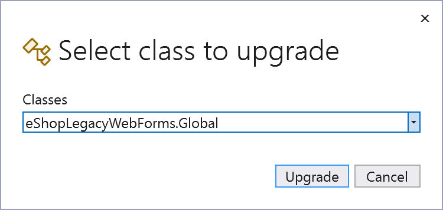

* The tool will list all dependencies of the selected class. For this example scenario, it will be all the entire application's contents. Because there is no upgrade path for **System.Web**, deselect these items from the list. The classes may be easier organize in **Flat view**, which is enabled on the upper right corner of the interface.

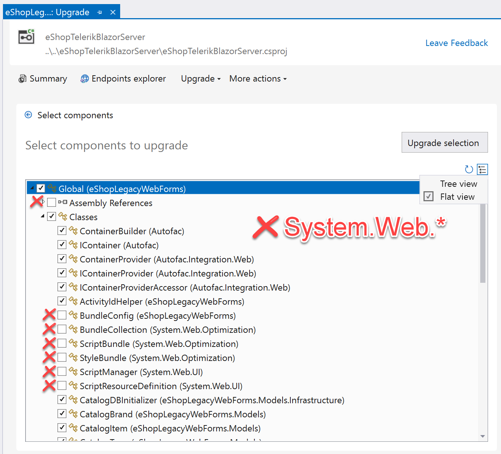

For simplicity this example will not include the migration steps for logging and **log4net**. Deselect the dependencies that use **log4net**. 

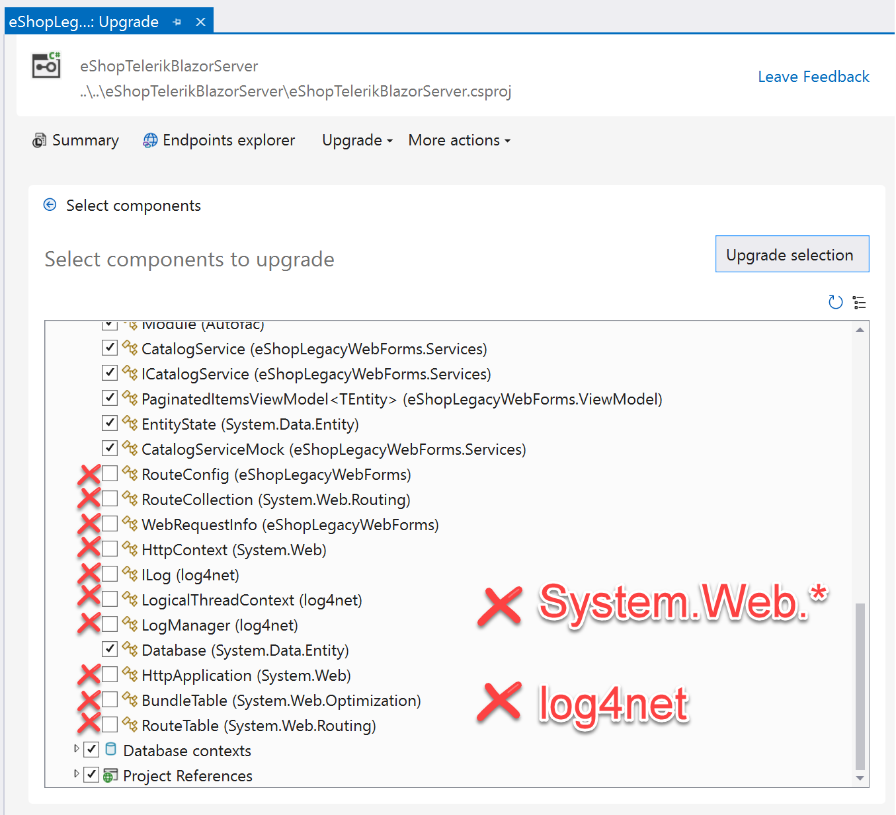

* Once the items have been selected/deselected, click the **Upgrade selection** button to continue.

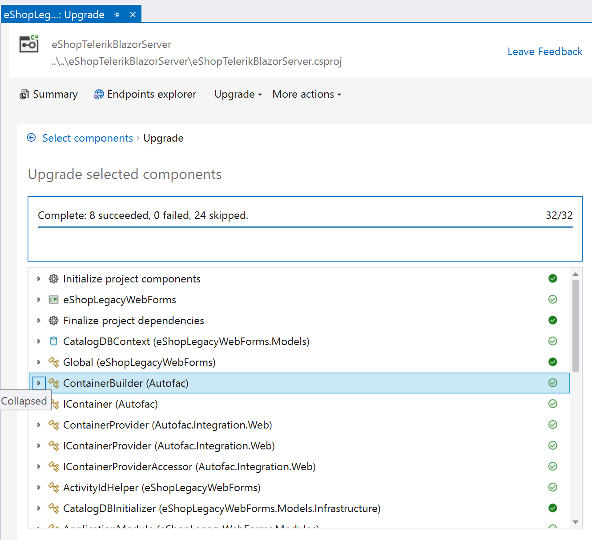

## Summary so far

<!-- write a summary of what we accomplished -->

* EF
* Services
* ...

# Manual migration

The **.NET Upgrade Assistant** has upgraded the project as much has possible using automation and it is now time to manually work on the project. In its current state, the project is not able to run as much of the code needs to be manually rewritten. The following are highlights of what needs to be completed before the migration is complete.

* There is no **Global.asax.cs** in ASP.NET Core. This file must be manually migrated to **Program.cs**
* Configuration has breaking changes between ASP.NET Framework and ASP.NET Core.
* Dependency injection (DI) is included in ASP.NET Core. 3rd party DI can be used, however manual changes are required to do so.
* Web Forms views **.aspx** must be completely reconstructed as Razor Components **.razor**.

<!-- continue list here -->

## Migrating Global.asax.cs

ASP.NET Core applications are standardized to follow the same conventions as the rest of the .NET ecosystem. The startup routine of an ASP.NET Core application uses a Program.cs file same as .NET Console, .NET MAUI, and many other application models. The **Program.cs** file is the next best equivalent to the **Global.asax.cs** file.

1. Examine the **Global.asax.cs** in **eShopLegacyWebForms**. Lines 29 & 30, were part of System.Web and not compatible with ASP.NET Core. RouteConfig is now handled by Razor Components through route directives. In addition, BundleConfig is no longer used and viable replacements such as WebPack can be used as needed. In this example, the Telerik UI for Blazor will introduce enough functionality out-of-the-box to replace many of the resources (.js and .css) typically bundled by WebPack. 

Next is **ConfigureContainer**. In Web Forms this method would configure the Dependency Injection (DI) container using AutoFac. In ASP.NET Core, DI is included as **Microsoft.Extensions.DependencyInjection** through the **IServiceCollection** interface. Because the legacy application used AutoFac it will be easier to migrate the existing configuration to a updated version of AutoFac that supports ASP.NET Core's **IServiceCollection**.

Last is **ConfigDataBase**. In Web Forms this method setup the EntityFramework configuration and database initialization methods. Included is a mock data setting used to run the application with an in memory database instead of SQL server.

```cs 
protected void Application_Start(object sender, EventArgs e)
{
    // Code that runs on application startup
    RouteConfig.RegisterRoutes(RouteTable.Routes); // 29
    BundleConfig.RegisterBundles(BundleTable.Bundles); // 30
    ConfigureContainer();
    ConfigDataBase();
}
```

2. Migrate **ConfigureContainer** to ASP.NET Core. The method will need to be rewritten inside of **Program.cs**.

```cs
// Original Method
private void ConfigureContainer()
{
    // This version of AutoFac is not compatible with ASP.NET Core
    var builder = new ContainerBuilder();
    // ConfigurationManager Not compatible with ASP.NET Core
    var mockData = bool.Parse(ConfigurationManager.AppSettings["UseMockData"]);
    builder.RegisterModule(new ApplicationModule(mockData));
    container = builder.Build();
    _containerProvider = new ContainerProvider(container);
}

```

* ASP.NET Framework's **System.Configuration.ConfigurationManager** is not compatible with ASP.NET Core's **Microsoft.Extensions.Configuration.ConfigurationManager** and will need to be updated. In **Program.cs** under `CreateBuilder`, write a statement that fetches the value of `UseMockData` from configuration.

```
var builder = WebApplication.CreateBuilder(args);
// App Settings
bool useMockData = bool.Parse(builder.Configuration["UseMockData"]!);
```

> Why the bang? The null forgiving operator '!' in the Parse statement ignores the "possibility of null" warning on this statement. If the value is null, it will cause an exception. In this case the exception is desired as it will force the application settings to be set before the application is allowed to run.

* Autofac will need to be updated to the latest version that supports .NET Core. Open the NuGet package manager, then browse for **Autofac**, and **Autofac.Extensions.DependencyInjection** and install both packages. After the pacakges are installed, add the following using statements to `Program.cs`.

```
using Autofac;
using Autofac.Extensions.DependencyInjection;
using eShopLegacyWebForms.Modules;
using eShopTelerikBlazorServer.Services;
```

* Use Autofac to re-implement **ConfigureContainer** in **Program.cs**. The new implementation will reuse the existing **ApplicationModule** code that was auto-migrated during the upgrade process. To implement Autofac, write a statement that uses **builder.Host.UseServiceProviderFactory**.

```
// Add services to the container.
builder.Host.UseServiceProviderFactory(new AutofacServiceProviderFactory())
        .ConfigureContainer<ContainerBuilder>(container =>
        {
            container.RegisterModule(new ApplicationModule(useMockData));
        });
```

3. Migrate **ConfigDataBase** to ASP.NET Core. The method will need to be rewritten inside of **Program.cs**.

```
private void ConfigDataBase()
{
    // ConfigurationManager Not compatible with ASP.NET Core
    // Already migrated in previous step
    var mockData = bool.Parse(ConfigurationManager.AppSettings["UseMockData"]);

    if (!mockData)
    {
        // Requires EF, see notes on EF vs EF Core
        // container.Resolve API has moved to IServiceProvider
        Database.SetInitializer<CatalogDBContext>(container.Resolve<CatalogDBInitializer>());
    }
}

```

> The **Database.SetInitializer** method and the **CatalogDBInitializer** class make heavy use of EntityFramework (EF). Instead of migrating all of the classes that interact with EF to EF Core, the code can be used with the latest version of EF. Minor updates will be needed for compatibility. The code related to EF can be migrated at a later time. For more information about the benefits of moving to EF Core see the offical documentation. [EF Core and EF6](https://learn.microsoft.com/en-us/ef/efcore-and-ef6/)

* Install the latest version of **EntityFramework**. Open NuGet Package Manager and search for **EntityFramework**, then install the package.

* Set the database initializer by adding a using statement for **System.Data.Entity**. Then update the statement `container.Resolve` to use the newer `GetRequiredService` method from the app's services container.

```
var app = builder.Build();

if (!useMockData)
{
    Database.SetInitializer(app.Services.GetRequiredService<CatalogDBInitializer>());
}
```

4. The database initializer is now set **CatalogDBInitializer**, however the CatalogDBInitializer class has errors due to breaking changes from ASP.NET Framework to ASP.NET Core. Migrate **CatalogDBInitializer** by updating the code identified by the compiler.

```
// Make sure to copy the files below from the old project
private const string CatalogItemHiLoSequenceScript = @"Models\Infrastructure\dbo.catalog_hilo.Sequence.sql"; // 17
private const string CatalogBrandHiLoSequenceScript = @"Models\Infrastructure\dbo.catalog_brand_hilo.Sequence.sql"; // 18
private const string CatalogTypeHiLoSequenceScript = @"Models\Infrastructure\dbo.catalog_type_hilo.Sequence.sql"; // 19
```

Update the following code. Replace **ConfigurationManager** with **IConfiguration**.

```csharp
//before
private bool useCustomizationData; // 22

public CatalogDBInitializer(CatalogItemHiLoGenerator indexGenerator) // 24
{
    this.indexGenerator = indexGenerator;
    useCustomizationData = bool.Parse(ConfigurationManager.AppSettings["UseCustomizationData"]);
}
```

* The resulting code should use DI to bring in **IConfiguration** and set the variable **useCustomizationData**

```csharp
//after
private readonly bool useCustomizationData;

public CatalogDBInitializer(CatalogItemHiLoGenerator indexGenerator, IConfiguration configuration)
{
    this.indexGenerator = indexGenerator;
    useCustomizationData = bool.Parse(configuration["UseCustomizationData"]!);
}
```

* The API **HostingEnvironment.ApplicationPhysicalPath** is used to get the physical path of the running application. This method is not part of **IWebHostEnvironment**. Replace instances of **HostingEnvironment.ApplicationPhysicalPath** with **IWebHostEnvironment**. Update all instances of contentRootPath.

```
private readonly bool useCustomizationData;
private readonly string contentRootPath;

public CatalogDBInitializer(CatalogItemHiLoGenerator indexGenerator, IConfiguration configuration, IWebHostEnvironment hostingEnvironment)
{
    this.indexGenerator = indexGenerator;
    useCustomizationData = bool.Parse(configuration["UseCustomizationData"]!);
    contentRootPath = hostingEnvironment.ContentRootPath;
}
```

5. Update the constructor for **CatalogDBContext**  **IConfiguration**. In CatalogDBContext.cs add an IConfiguration parameter to the constructor. Then, pass the connection string from the IConfiguration to the **base** constructor.

```csharp
public CatalogDBContext(IConfigurationconfiguration) : base(configuration.GetConnectionString("CatalogDBCotext"))
{
}
```

6. **Global.asax.cs** is not used in ASP.NET Core. Remove **Global.asax.cs** from the **eShopTelerikBlazorServer** project.

7. At this point the **eShopTelerikBlazorServer** project should compile without errors. Build and Start the application. The application will fail to start because the application settings have not yet been migrated.

* In **ASP.NET Framework** application settings were stored in the **Web.config** file. With ASP.NET Core settings are now stored in **appsettings.json**. Migrate the settings from Web.config to appsettings.json.

appsettings.json
```json
{ ... existing settings ... }
,
  "UseMockData": true,
  "UseCustomizationData": false,
  "ConnectionStrings": {
    "CatalogDBContext": "Server=(localdb)\\mssqllocaldb;Initial Catalog=Microsoft.eShopOnContainers.Services.CatalogDb;Trusted_Connection=True;MultipleActiveResultSets=true;"
  }
```

* At this point the **eShopTelerikBlazorServer** project should start without errors. Build and Start the application.

8. Copy static assets from **eShopLegacyWebForms\Pics** to **eShopTelerikBlazorServer\wwwroot\Pics**. In ASP.NET Core, the static assets must be in the **wwwroot** folder to be served to the client. 

9. (optional) Write a quick example to check data connectivity. Replace the code in **Index.razor**. Inject the **ICatalogService** and display data on the page. Try setting the **UseMockData** value to **true** and verify the SQL database is created.

```razor
@page "/"
@using eShopLegacyWebForms.Models;
@using eShopLegacyWebForms.Services;

@inject ICatalogService CatalogService

@foreach (var item in catalogs)
{
    <p>@item.Name</p>
}

@code {
    CatalogItem[]? catalogs;

    protected override Task OnInitializedAsync()
    {

        catalogs = CatalogService.GetCatalogItemsPaginated(10,0).Data.ToArray();
        return base.OnInitializedAsync();
    }
}
```


## Migrating views with Teleirk UI for Blazor

With the application's core logic migrated, the views for the application will need to be rewritten for Blazor. To shorten development time Telerik UI for Blazor is used. Telerik UI for Blazor includes 100+ UI components, productivity tools, and customization features that shorten development cycles.

There are four main views in the **eShopLegacyWebForms** application. The **Default** grid view and **Create**, **Edit** and **Delete** views. The views are responsible for managing the **Catalog Items** in a database. Using the Telerik Grid, all four views can be consolidated and managed using just one component. In addition, scaffolding can be used to assist in the view's creation.

1. Use the Telerik UI for Blazor's scaffolding tool to create a new page that displays Catalog Items using the Telerik Grid.

> The Scaffolding tool is part of the Telerik Extensions for Visual Studio. If the extension isn't installed, it can be added from the [Visual Studio Marketplace](https://marketplace.visualstudio.com/items?itemName=TelerikInc.ProgressTelerikBlazorVSExtensions), or the Telerik UI for Blazor installer. Important: Telerik UI for Blazor is required to make use of the extension.

* In the **eShopTelerikBlazorServer** delete Index.razor, it will be replaced by a new view.

* Start the scaffolding tool by right clicking on the **eShopTelerikBlazorServer** project and choosing **Telerik UI for Blazor** from the menu, then click **Add new Scaffolded Item**.

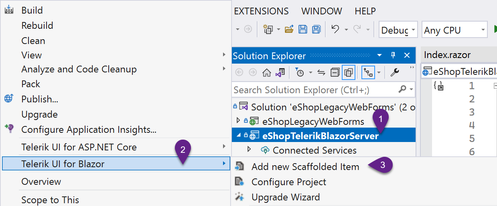

* Select the Grid component (if not already selected) in the Blazor Scaffolding Wizard dialog. 

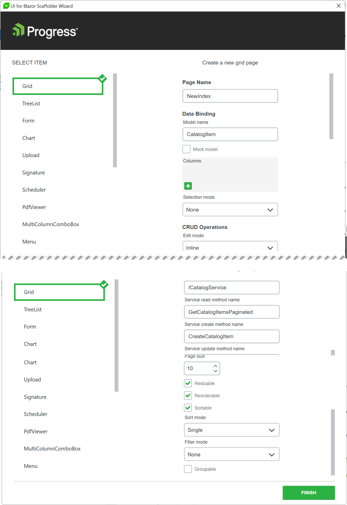

* Apply the following settings to the Grid
    * Page name: **New Index**
    * Model name: **CatalogItem**
    * (uncheck) Mock model 
    * Edit mode: **Popup**
    * Service name: **ICatalogService**
    * Service read method name  : **GetCatalogItemsPaginated**
    * Service create method name: **CreateCatalogItem** 
    * Service update method name: **UpdateCatalogItem**
    * Service delete method name: **RemoveCatalogItem**
    * (check) Pageable
    * (check) Resizeable
    * (check) Reorderable
    * (check) Sortable
    * Filter mode: **Filter Menu**
    * Click Finish

* Update the page route directive from "/NewIndex" to "/".
```
@page "/"
```

* Bring dependencies into scope by adding the following using statements to `_Imports.razor`.
```
@using Telerik.FontIcons
@using eShopLegacyWebForms.Models
@using eShopLegacyWebForms.Services
```

* The scaffolding tool defaults to **async** methods. Replace `async Task` with `void` for LoadData, Create, Update, and Delete methods. Remove the `await` keyword from all LoadData statements.

> Modern .NET applications make heavy use of async/await. By default the scaffolding tool creates async methods. To further modernize the codebase async/await is recomended for services, however migrating services is beyond the scope of the workshop.

* Update the service call in LoadData. Use the **GetCatalogItemsPaginated** method to get the first 10 items from the first page of data in the database. The method returns a view model with a Data property which contains the resulting CategoryItems. Apply the results to the page's Data property.

```
Data =  DataService.GetCatalogItemsPaginated(10,0).Data.ToList();
```

* The Telerik Data Grid's auto-generated columns feature allows the grid to generate columns based on meta data. The CategoryItem's properties and annotations effect what columns show and how they're formatted. Run the application to see the auto-generated grid.

> Depending on the scenario, generated columns can be enough to complete the task. Alternatively, columns can be defined in markup for complete customization with templates. This workshop demonstrates both approaches.

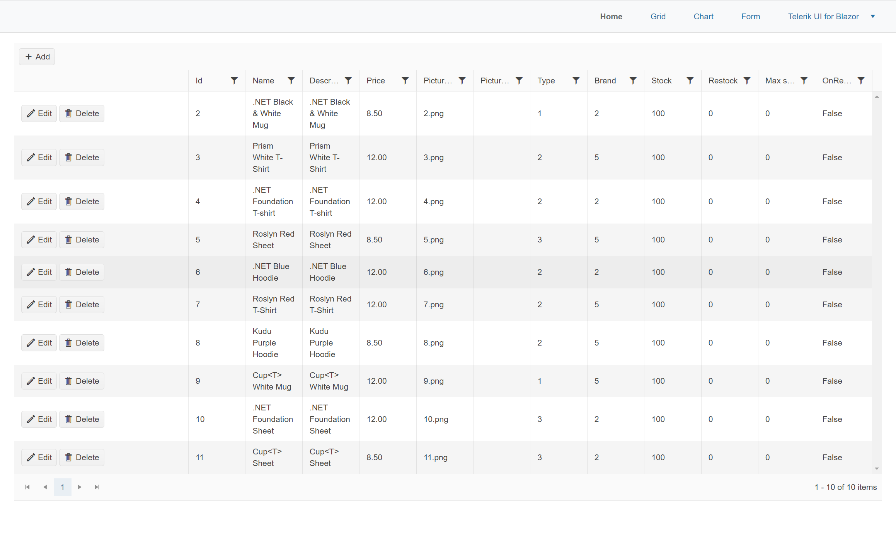

2. To enhance the performance of the application and reduce development time, the Telerik Grid can work directly with Entity Framework (EF). Through the Telerik DataSourceRequest object, the grid will supply EF with state information such as: sort, filter, and page selections. This state data is presented to EF as an expression that it can create SQL queries from. Enable query based paging, sorting, and filtering using the Telerik DataSourceRequest.

* Modify the **CatalogService** and **CatalogServiceMock** to implement the Telerik **DataSourceRequest** object. Replace the **GetCatalogItemsPaginated** method. The method should return a Telerik **DataSourceResult** and take a **DataSourceRequest** as a parameter. Replace the existing OrderBy, Skip, and Take LINQ methods with the ToDataSourceResultAsync extension method. The **ToDataSourceResultAsync** method takes the **request** argument and applies the grid's meta data to the query.

```
public Task<DataSourceResult> GetCatalogItemsPaginated(DataSourceRequest request)
{
    return db.CatalogItems
        .Include(c => c.CatalogBrand)
        .Include(c => c.CatalogType)
        .ToDataSourceResultAsync(request);
}
```

* For the **CatalogServiceMock** use the **AsQueryable** method to cast the mocked items as Queryable before applying the **ToDataSourceResultAsync** extension method.

```
public Task<DataSourceResult> GetCatalogItemsPaginated(DataSourceRequest request)
{
    var items = ComposeCatalogItems(catalogItems);

    return items.AsQueryable().ToDataSourceResultAsync(request);
}
```

* Update the **ICatalogService** interface with the new method signature.

```
Task<DataSourceResult> GetCatalogItemsPaginated(DataSourceRequest request);
```

* In **NewIndex.razor**, make use of Telerik Grid's **OnRead** event. The OnRead event's GridReadEventArgs argument contains the **DataSourceRequest** which is needed by **GetCatalogItemsPaginated**. Update the LoadData event to an **async Task**, then add a parameter for the **GridReadEventArgs**.

```
async Task LoadData(GridReadEventArgs args)
{
    DataSourceResult results = await DataService.GetCatalogItemsPaginated(args.Request);
    args.Data = results.Data; // apply Data
    args.Total = results.Total; // update Totals
}
```

* Update the **TelerikGrid** component, add a delegate for the **OnRead** event that uses the **LoadData** method.

```
<TelerikGrid Data="@Data" ... OnRead="@LoadData">
```

* The Telerik Grid will no internally trigger the OnRead event as needed. It is no longer necessary to manually call LoadData. **Remove** all calls to **LoadData**.

```
// Remove all
LoadData();
```

* Run the application, try sorting, filtering and paging the data. Note that all actions are directly translated to SQL queries that only fetch the necessary data from the database, thus reducing server overhead.

3. The Telerik Grid can easily be customized with a wide variety of templates. Add a GridColumn template to show an image from the CatalogItem. The Template can contain any HTML element, Razor code, and components.

* Add a GridColumn to the GridColumns element.

* Set the GridColumn with the following properties:
  * Field="@nameof(CatalogItem.PictureFileName)"
  * Title="Picture"
  * Width="130px"
  * Filterable="false"
  * Editable="false"

```
<GridColumns>
    <GridColumn Field="@nameof(CatalogItem.PictureFileName)" Title="Picture" Width="130px" Filterable="false" Editable="false">
    </GridColumn>
    ...
<GridColumns>
```

* Inside the GridColumn, add a Template with a razor code block `@{}` inside. Within the code block write a razor snippet that displays the PictureFileName in an HTML **img** element.

```
<GridColumn Field="@nameof(CatalogItem.PictureFileName)" Title="Picture" Width="130px" Filterable="false" Editable="false">
    <Template>
        @{
            var item = (CatalogItem)context;
            
        }
    </Template>
</GridColumn>
```

* Run the application and examine the template column.

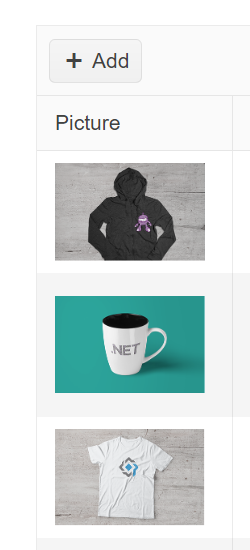

> Note: AutogeneratedColumns and custom columns can be mixed within the grid using the <AutogeneratedColumns/> tag. However, in the next exercise the  AutogeneratedColumns feature will be disabled to further explore column customization with the Telerik Grid.

4. Disable the AutoGenerateColumns columns feature. Then add columns for the remianing properties of the CatalogItem class.

```
<TelerikGrid ... AutoGenerateColumns="false" .../>
```

> Note: Field names are easily set and maintained using the `nameof` operator. However, some values require a string literal to produce the proper navigation to deeply nested property names. Example: The field CatalogItem.CatalogBrand.Brand, can't be expressed with `nameof`, and must be represented as the string `CatalogBrand.Brand`.

```
<GridColumns>
        ...
        <GridColumn Field="@nameof(CatalogItem.Name)" />
        <GridColumn Field="@nameof(CatalogItem.Description)" />
        <GridColumn Field="CatalogBrand.Brand" Title="Brand"/>
        <GridColumn Field="CatalogType.Type" Title="Type" />
        <GridColumn Field="@nameof(CatalogItem.Price)" />
        <GridColumn Field="@nameof(CatalogItem.PictureFileName)" Title="Picture Name" />
        <GridColumn Field="@nameof(CatalogItem.AvailableStock)" Title="Stock" />
        <GridColumn Field="@nameof(CatalogItem.RestockThreshold)" Title="Restock" />
        <GridColumn Field="@nameof(CatalogItem.MaxStockThreshold)" Title="Max Stock" />
</GridColumns>
```

5. Use the GridColumn's **DisplayFormat** property to display the column's values in a currency format.

```
<GridColumn Field="@nameof(CatalogItem.Price)" DisplayFormat="{0:C}" />
```

6. Set the FilterMenuType to **FilterMenuType.CheckBoxList** for the Brand and Type columns.

> The Telerik Grid has menu options that offer a better UX for certain data sets. The CheckBoxList menu aggregates data inside a simple checkbox list menu. Try toggling the menu types to see the difference.

```
<GridColumn Field="CatalogBrand.Brand" Title="Brand" FilterMenuType="@FilterMenuType.CheckBoxList"/>
```

```
<GridColumn Field="CatalogType.Type" Title="Type" FilterMenuType="@FilterMenuType.CheckBoxList"/>
```

* Run the application and view the customized grid, try filtering different columns.

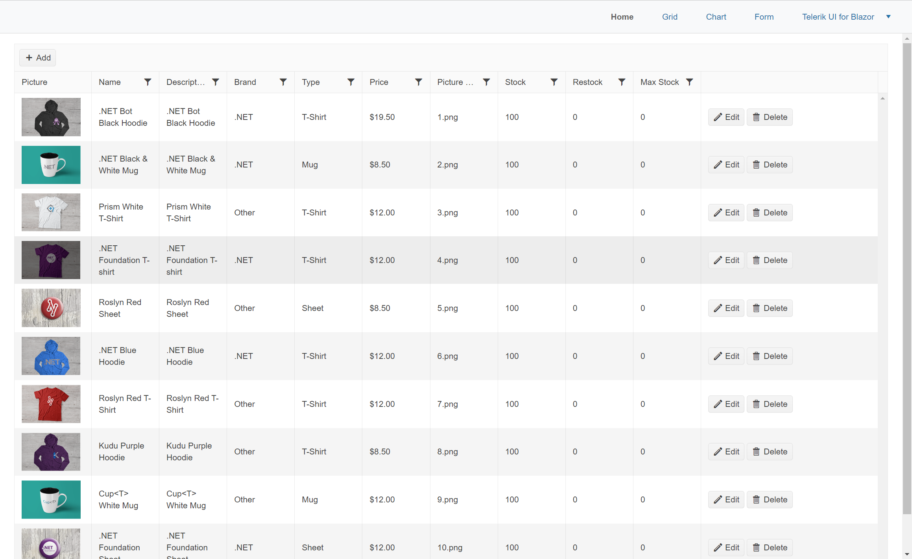

## Telerik Grid editing operations

In the original application individual views were used for creating, editing, and deleting data. The Telerik Grid can perform these tasks using one of several built-in editor. Depending on the data model, editing operations may be completely automated by the Telerik Grid. In this scenario, some additional steps are required to customize the experience using templates. 

1. Run the application, click the edit button for an item and examine the generated popup editor. Note the **Brand** and **Type** editors are text boxes, however in the model these fields are backed by an Id number.

* Next, click save. When the application is using EF instead of mock data it will throw an exception in **CatalogService**. This error is due to entity tracking, and caused by changes made to the **GetCatalogItemsPaginated** method in a previous exercise. To resolve the exception, reattach and update the entity before saving.

```
public void UpdateCatalogItem(CatalogItem catalogItem)
{
    // reattach entity
    var item = db.CatalogItems.Find(catalogItem.Id); 
    // update entity 
    db.Entry(item).CurrentValues.SetValues(catalogItem);
    // Set the item's state to modified 
    db.Entry(item).State = EntityState.Modified;
    db.SaveChanges();
}
```

2. Add a custom editor for CatalogType and CatalogBrand using the GridColumn's **EditorTemplate** feature. In the EditorTemplate use a **TelerikDropDownList**.

* In the code section add a private field to hold the collection of CatalogType and CatalogBrand. Set the fields to an empty collection. Next, use the OnInitializedAsync method to fetch to populate the fields using the DataService's GetCatalogTypes and GetCatalogBrands methods.

```
private IEnumerable<CatalogType> types = Array.Empty<CatalogType>();
private IEnumerable<CatalogBrand> brands = Array.Empty<CatalogBrand>();

protected override Task OnInitializedAsync()
{
    types = DataService.GetCatalogTypes();
    brands = DataService.GetCatalogBrands();
    return base.OnInitializedAsync();
}
```

* Update the **GridColumn** for **CategoryBrand** with an **EditorTemplate**. Open a new EditorTemplate, inside use a razor code block to get the CatalogItem and bind its values to a **TelerikDropDownList**. The TelerikDropDownList's bindings should be:
    * Data="@brands"
    * TextField="Brand"
    * ValueField="Id"
    * bind-value="item.CatalogBrandId"
    
* Repeat the process for the CatalogType column.

```
<GridColumn Field="CatalogBrand.Brand" Title="Brand" FilterMenuType="@FilterMenuType.CheckBoxList">
    <EditorTemplate>
        @{
            var item = (CatalogItem)context;
            <TelerikDropDownList Data="@brands" TextField="Brand" ValueField="Id" @bind-Value="item.CatalogBrandId"/>
        }
    </EditorTemplate>
</GridColumn>
<GridColumn Field="CatalogType.Type" Title="Type" FilterMenuType="@FilterMenuType.CheckBoxList">
    <EditorTemplate>
        @{
            var item = (CatalogItem)context;
            <TelerikDropDownList Data="@types" TextField="Type" ValueField="Id" @bind-Value="item.CatalogTypeId"/>
        }
    </EditorTemplate>
</GridColumn>
```

* Start the application and try to **edit a record**. The record should submit and update successfully. 

3. Start the application and try to **add** a record. This will cause an exception to occur. When using complex models sometimes the grid will need help initializing an empty record. In this instance, the new record is causing an execption because the CatalogBrand and CatalogType are intitializing as null. The Telerik Grid features an OnAdd which fires when the Add command button for a newly added item is clicked.

* Use the "OnAdd" event to initialize a new CatalogItem when the Add button is clicked.

```
async Task OnAdd(GridCommandEventArgs args)
{
    var newItem = (CatalogItem)args.Item;
    //Set default values for new items
    newItem.Name = "Untitled";
    newItem.Description = "Description...";
    newItem.CatalogBrand = brands.First();
    newItem.CatalogType = types.First();
    newItem.CatalogTypeId = types.First().Id;
    newItem.CatalogBrandId = brands.First().Id;
    newItem.PictureUri = "";
    //Cancel if needed
    //args.IsCancelled = true;
}
```

* Delegate the new method to the OnAdd event on the TelerikGrid.

```
<TelerikGrid ... OnAdd="@OnAdd">
```

* Start the application and try to **add a record**. The record should submit and update successfully. The new record will appear on the last page of the grid.

3. The Telerik Grid includes a built-in dialog to prevent accendental deletion of records. To enable the dialog simply set the ConfirmDelete property on the grid to `true`.

* Start the application and try to **delete a record**. The action should cause a prompt confirming the action.

```
<TelerikGrid ... ConfirmDelete="true">
```