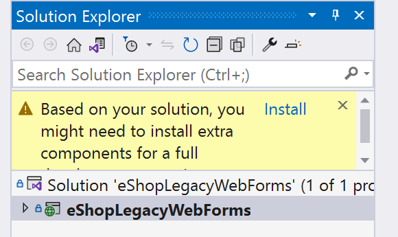
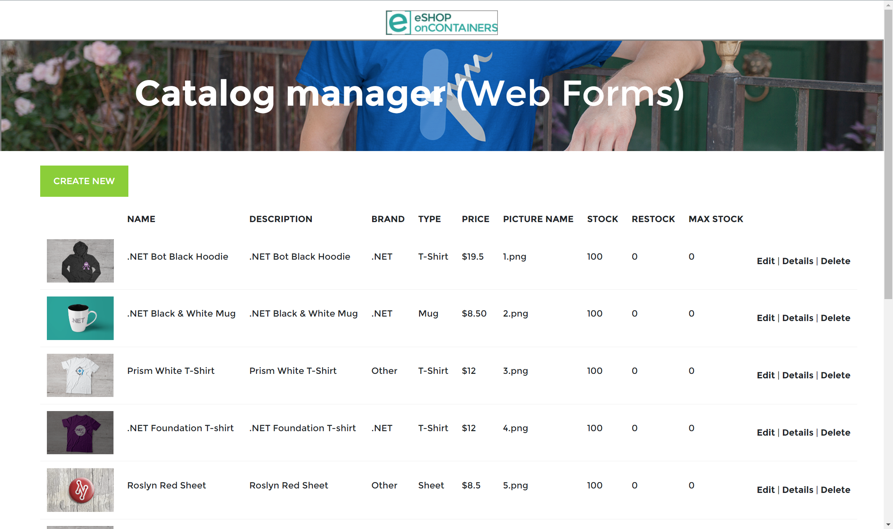
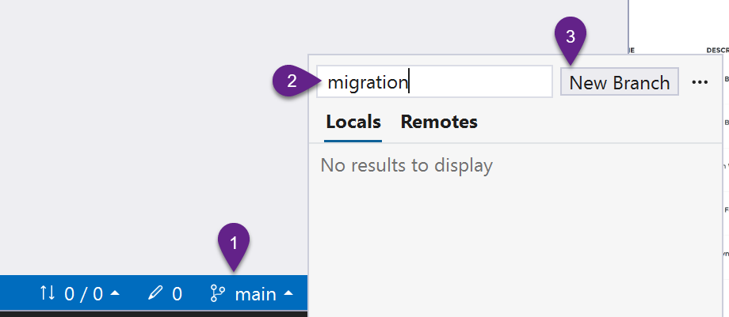

## Prerequisites 

<!-- ??? 
```
		<UseRazorSourceGenerator>true</UseRazorSourceGenerator>
		<Nullable>enable</Nullable>
```		
-->

To complete the workshop be sure to install all of the following prerequisite items. All of the items below have **free, or free trial** options. If you have **existing paid licenses** of the Visual Studio 2022 or Telerik UI for Blazor **please use those** and do not reinstall the free versions.

* [Visual Studio 2022 [Any Edition]](https://visualstudio.microsoft.com/downloads/)
* [.NET 7.0.5 or later](https://dotnet.microsoft.com/en-us/download/dotnet/7.0)
* [Telerik UI for Blazor Free Trial or Licensed](https://www.telerik.com/try/ui-for-blazor)
* [.NET Upgrade Assistant for VS 2022 (Preview)](https://marketplace.visualstudio.com/items?itemName=ms-dotnettools.upgradeassistant)
* [eShopModernizing GitHub Repository](https://github.com/dotnet-architecture/eShopModernizing)

## Getting started

1. Clone the [eShop Repository](https://github.com/dotnet-architecture/eShopModernizing) which contains the sample Web Forms application. 

	Throughout this workshop we will be migrating the eShop sample application provided by **Microsoft via GitHub**. If you have not already created a clone of the repository, create one now. This repository contains multiple eShop solutions. For this workshop we will be using the **eShopLegacyWebForms** solution.

2. Open the **eShopLegacyWebForms** solution and install any missing frameworks. This step may vary from system to system.

	After cloning the application, navigate to the solution in Visual Studio. You will see multiple solution files in the repository, choose **eShopLegacyWebForms**. Be aware of any notifications from Visual Studio that might inform you of additional dependencies that will need to be installed. Look for a yellow banner with an **Install** link in the **Solution Explorer**. Click install, follow the prompts and complete the installation as needed.

	 
	
	{: .note-title }
	After installing frameworks and workloads a reboot of Visual Studio may be necessary.

3. Start the eShopLegacyWebForms application. From Visual Studio click **Start** or press **F5**. The sample application is a simple store management page with view, create, edit, and delete functions.

	> Troubleshooting tip: If the application does not run on the first try, Start the application a second time. The first time building the project occasionally hits a race condition where resources are not yet ready for the application to run. Running the app a second time typically works.

	

4. After verifying the application starts properly, close the browser or stop the application from Visual Studio.

	Take a moment to review the structure of the application and become familiar with its parts.

	* **App_Start**, this folder contains the startup routines for the application.
	* **Catalog**, this folder contains the Create, Delete, Details, and Edit features for the application.
	* **Models**, this folder contains various data models for the application and its database. 
	* **Modules**, this folder contains dependency injection (DI) configurations for AutoFac.
	* **Services**, this folder contains data services used in the application.
	* **ViewModel**, this folder contains a class used as a data projection for the application's main view.

5. Create a branch named `migration`. This branch will contain the migrated application and track changes to the application.

	