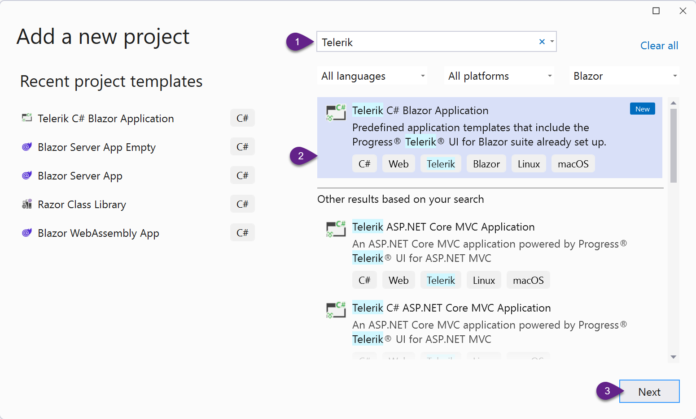
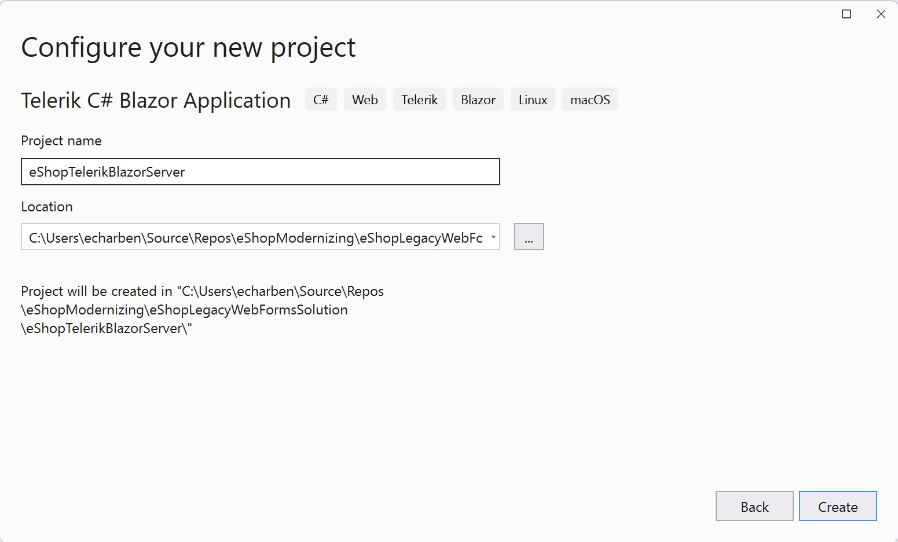
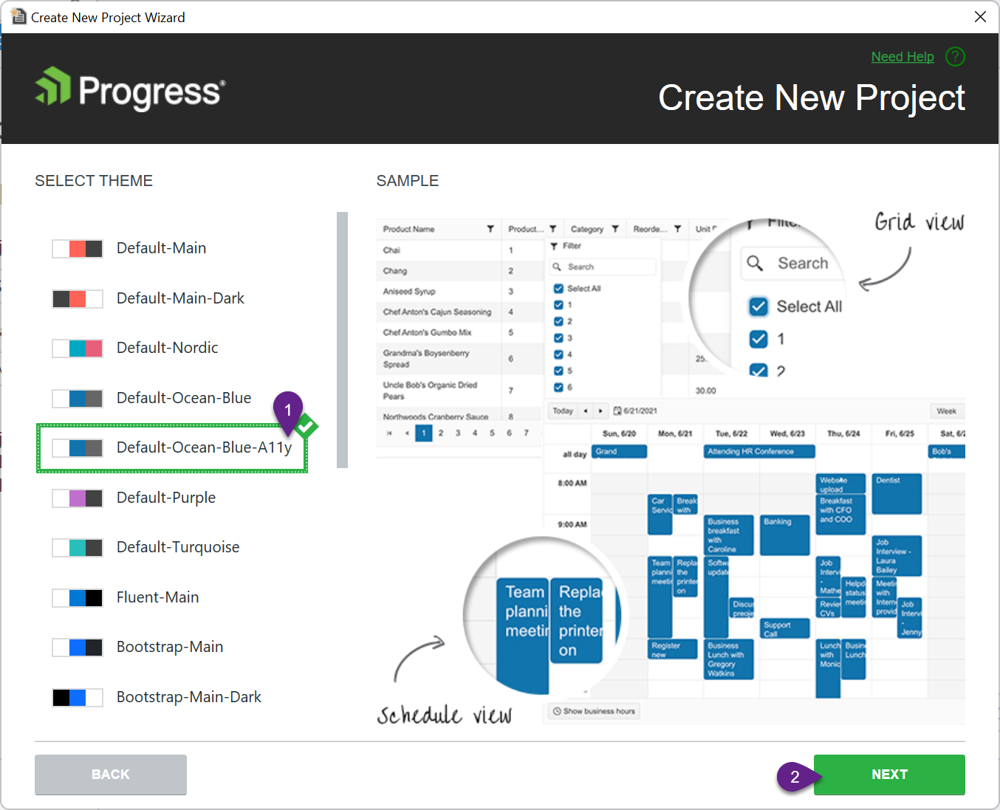
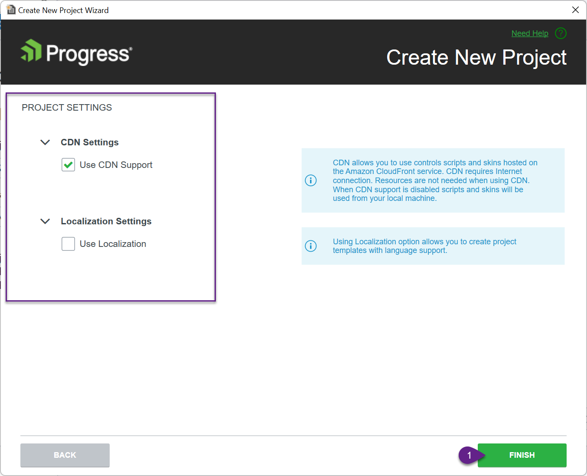
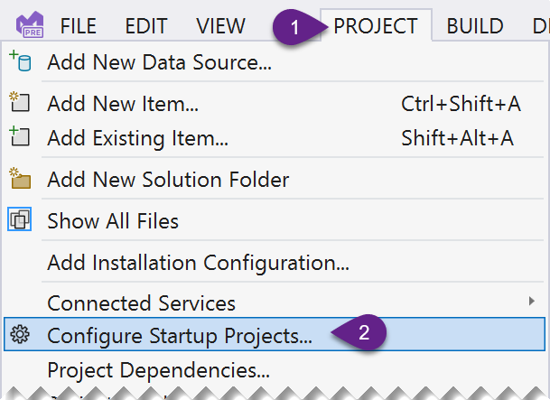
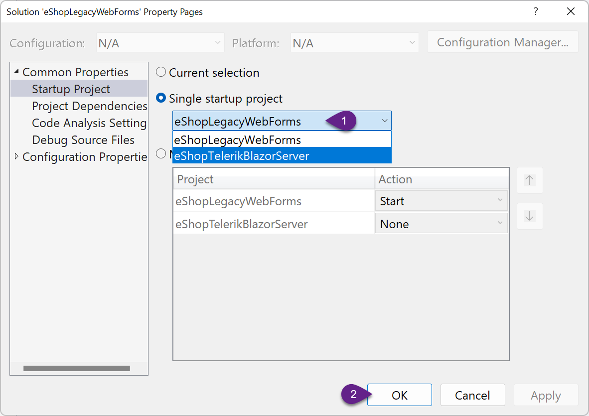
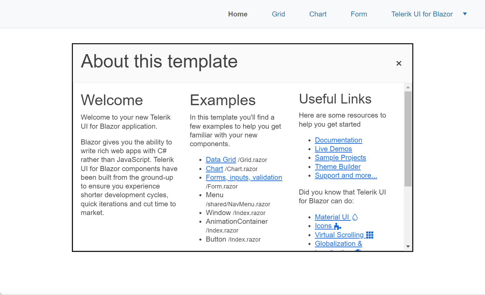

# Creating a new project

Because of the number of differences between .NET Framework and ASP.NET Core, the app will be migrated to a brand new project. In addition, there is no direct migration path for Web Forms views to ASP.NET Core and the views will need to be completely rewritten. The Telerik UI for Blazor templates, scaffolding tools, and components will reduce the amount of coding needed to write new views.

{: .note-title }
> The Telerik Extensions for Visual Studio are added to Visual Studio when installing Telerik UI for Blazor. If the extension isn't installed, it can be added from the [Visual Studio Marketplace](https://marketplace.visualstudio.com/items?itemName=TelerikInc.ProgressTelerikBlazorVSExtensions), or the Telerik UI for Blazor installer. Important: Telerik UI for Blazor is required to make use of the extension.

1. Create a new Telerik UI for Blazor Server application. This application will be the migration target. To create a Telerik UI for Blazor application in the solution:

    * Right click on the root item in the solution, **Solution, eShopLegacyWebForms**.
    * Select the **Telerik C# Blazor Application** template.
    * Click Next

    

    * Name the project **eShopTelerikBlazorServer**.
    * Click Create

    

    * Select a Telerik theme. The **Default-Ocean-Blue-A11y** is a recommended starting point because the colors have been tested for optimal accessibility. 

    

    * For the workshop the default project settings will be used. 
      * [x] Use CDN Support is enabled.
      * [ ] Use Localization is disabled 
      
      {: .tip-title }
      When using Telerik UI for Blazor on projects that require localization, the option can be enabled here and localization resources will be generated. Localization is not discussed in this workshop, so the option is left disabled.
      
      * Click finish to generate the new project.

    

2. Set the startup project to the Blazor Server project,  **eShopTelerikBlazorServer**. Choose **Configure Startup Projects** from the **Project** menu.

    

    

    * Select the **eShopTelerikBlazorServer** project from the **Single startup project** option. This menu can be revisited at any time to switch startup projects, or enable multiple startup projects.

3. Start the **eShopTelerikBlazorServer** project by clicking **Start** or pressing **F5**.

    

4. Explore the new application to see an example of Telerik UI for Blazor's components and capabilities.

    * `/` the root page demonstrates the window component and notification components. The code for this view is located in `Index.razor`.
    * `/grid` the grid page displays a sample Telerik Grid component with Create, Read, Update and Delete operations.
    * `/chart` the chart page shows one of the many charts available in Telerik UI for Blazor.
    * `/form` the form page uses the Telerik Form component and its automatic form generation features.
