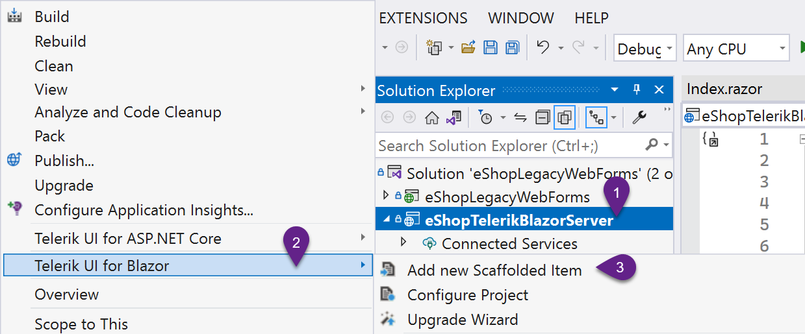
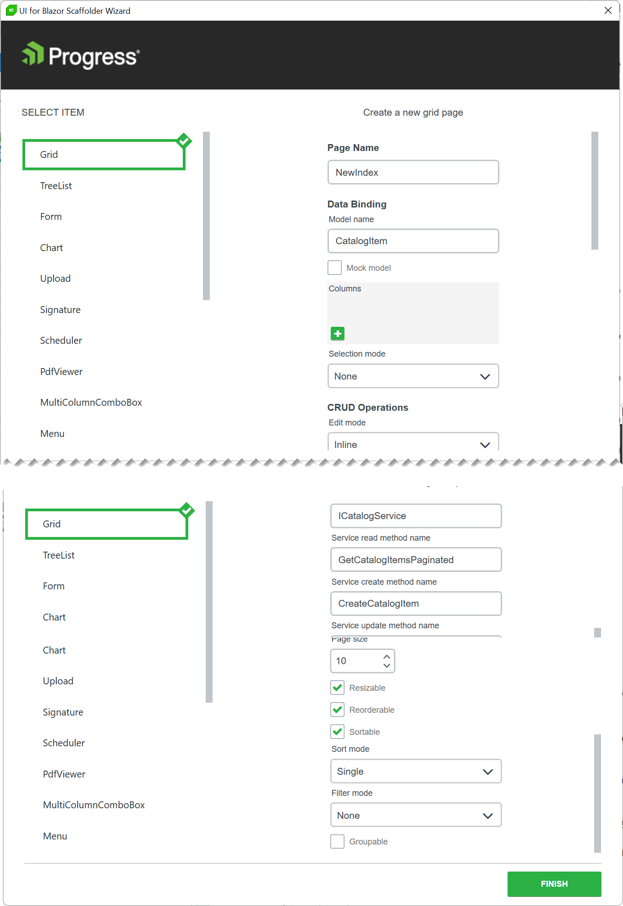
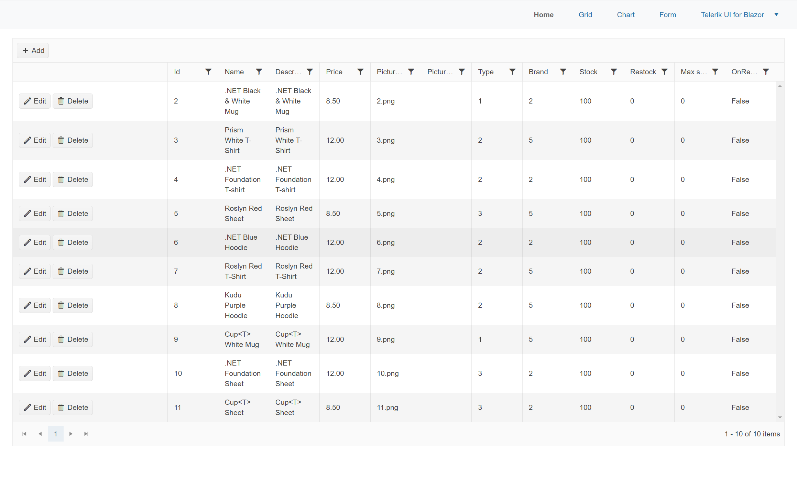
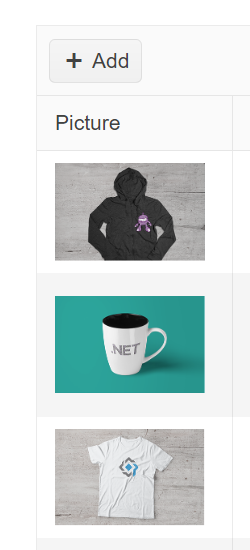
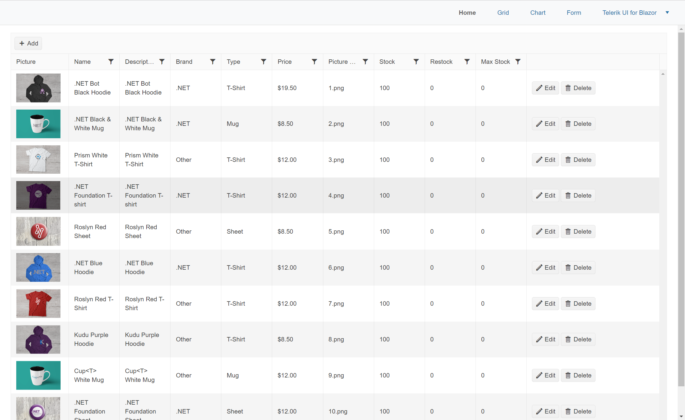

# Migrating views with Teleirk UI for Blazor

With the application's core logic migrated, the views for the application will need to be rewritten for Blazor. To shorten development time Telerik UI for Blazor is used. Telerik UI for Blazor includes 100+ UI components, productivity tools, and customization features that shorten development cycles.

There are four main views in the **eShopLegacyWebForms** application. The **Default** grid view and **Create**, **Edit** and **Delete** views. The views are responsible for managing the **Catalog Items** in a database. Using the Telerik Grid, all four views can be consolidated and managed using just one component. In addition, scaffolding can be used to assist in the view's creation.

1. Use the Telerik UI for Blazor's scaffolding tool to create a new page that displays Catalog Items using the Telerik Grid.

    > The Scaffolding tool is part of the Telerik Extensions for Visual Studio. If the extension isn't installed, it can be added from the [Visual Studio Marketplace](https://marketplace.visualstudio.com/items?itemName=TelerikInc.ProgressTelerikBlazorVSExtensions), or the Telerik UI for Blazor installer. Important: Telerik UI for Blazor is required to make use of the extension.

    * In the **eShopTelerikBlazorServer** delete Index.razor, it will be replaced by a new view.

    * Start the scaffolding tool by right clicking on the **eShopTelerikBlazorServer** project and choosing **Telerik UI for Blazor** from the menu, then click **Add new Scaffolded Item**.

    

    * Select the Grid component (if not already selected) in the Blazor Scaffolding Wizard dialog. 

    

    * Apply the following settings to the Grid
        * Page name: **New Index**
        * Model name: **CatalogItem**
        * (uncheck) Mock model 
        * Edit mode: **Popup**
        * Service name: **ICatalogService**
        * Service read method name  : **GetCatalogItemsPaginated**
        * Service create method name: **CreateCatalogItem** 
        * Service update method name: **UpdateCatalogItem**
        * Service delete method name: **RemoveCatalogItem**
        * (check) Pageable
        * (check) Resizeable
        * (check) Reorderable
        * (check) Sortable
        * Filter mode: **Filter Menu**
        * Click Finish

    * Update the page route directive from "/NewIndex" to "/".

    ```html
    @page "/"
    ```

    * Bring dependencies into scope by adding the following using statements to `_Imports.razor`.

    ```html
    @using Telerik.FontIcons
    @using eShopLegacyWebForms.Models
    @using eShopLegacyWebForms.Services
    ```

    * The scaffolding tool defaults to **async** methods. Replace `async Task` with `void` for LoadData, Create, Update, and Delete methods. Remove the `await` keyword from all LoadData statements.

    > Modern .NET applications make heavy use of async/await. By default the scaffolding tool creates async methods. To further modernize the codebase async/await is recomended for services, however migrating services is beyond the scope of the workshop.

    * Update the service call in LoadData. Use the **GetCatalogItemsPaginated** method to get the first 10 items from the first page of data in the database. The method returns a view model with a Data property which contains the resulting CategoryItems. Apply the results to the page's Data property.

    ```
    Data =  DataService.GetCatalogItemsPaginated(10,0).Data.ToList();
    ```

    * The Telerik Data Grid's auto-generated columns feature allows the grid to generate columns based on meta data. The CategoryItem's properties and annotations effect what columns show and how they're formatted. Run the application to see the auto-generated grid.

    > Depending on the scenario, generated columns can be enough to complete the task. Alternatively, columns can be defined in markup for complete customization with templates. This workshop demonstrates both approaches.

    

2. To enhance the performance of the application and reduce development time, the Telerik Grid can work directly with Entity Framework (EF). Through the Telerik DataSourceRequest object, the grid will supply EF with state information such as: sort, filter, and page selections. This state data is presented to EF as an expression that it can create SQL queries from. Enable query based paging, sorting, and filtering using the Telerik DataSourceRequest.

    * Modify the **CatalogService** and **CatalogServiceMock** to implement the Telerik **DataSourceRequest** object. Replace the **GetCatalogItemsPaginated** method. The method should return a Telerik **DataSourceResult** and take a **DataSourceRequest** as a parameter. Replace the existing OrderBy, Skip, and Take LINQ methods with the ToDataSourceResultAsync extension method. The **ToDataSourceResultAsync** method takes the **request** argument and applies the grid's meta data to the query.

    ```csharp
    public Task<DataSourceResult> GetCatalogItemsPaginated(DataSourceRequest request)
    {
        return db.CatalogItems
            .Include(c => c.CatalogBrand)
            .Include(c => c.CatalogType)
            .ToDataSourceResultAsync(request);
    }
    ```

    * For the **CatalogServiceMock** use the **AsQueryable** method to cast the mocked items as Queryable before applying the **ToDataSourceResultAsync** extension method.

    ```csharp
    public Task<DataSourceResult> GetCatalogItemsPaginated(DataSourceRequest request)
    {
        var items = ComposeCatalogItems(catalogItems);

        return items.AsQueryable().ToDataSourceResultAsync(request);
    }
    ```

    * Update the **ICatalogService** interface with the new method signature.

    ```csharp
    Task<DataSourceResult> GetCatalogItemsPaginated(DataSourceRequest request);
    ```

    * In **NewIndex.razor**, make use of Telerik Grid's **OnRead** event. The OnRead event's GridReadEventArgs argument contains the **DataSourceRequest** which is needed by **GetCatalogItemsPaginated**. Update the LoadData event to an **async Task**, then add a parameter for the **GridReadEventArgs**.

    ```csharp
    async Task LoadData(GridReadEventArgs args)
    {
        DataSourceResult results = await DataService.GetCatalogItemsPaginated(args.Request);
        args.Data = results.Data; // apply Data
        args.Total = results.Total; // update Totals
    }
    ```

    * Update the **TelerikGrid** component, add a delegate for the **OnRead** event that uses the **LoadData** method.

    ```
    <TelerikGrid Data="@Data" ... OnRead="@LoadData">
    ```

    * The Telerik Grid will no internally trigger the OnRead event as needed. It is no longer necessary to manually call LoadData. **Remove** all calls to **LoadData**.

    ```csharp
    // Remove all
    LoadData();
    ```

    * Run the application, try sorting, filtering and paging the data. Note that all actions are directly translated to SQL queries that only fetch the necessary data from the database, thus reducing server overhead.

3. The Telerik Grid can easily be customized with a wide variety of templates. Add a GridColumn template to show an image from the CatalogItem. The Template can contain any HTML element, Razor code, and components.

    * Add a GridColumn to the GridColumns element.

    * Set the GridColumn with the following properties:
    * Field="@nameof(CatalogItem.PictureFileName)"
    * Title="Picture"
    * Width="130px"
    * Filterable="false"
    * Editable="false"

    ```html
    <GridColumns>
        <GridColumn Field="@nameof(CatalogItem.PictureFileName)" Title="Picture" Width="130px" Filterable="false" Editable="false">
        </GridColumn>
        ...
    <GridColumns>
    ```

    * Inside the GridColumn, add a Template with a razor code block `@{}` inside. Within the code block write a razor snippet that displays the PictureFileName in an HTML **img** element.

    ```html
    <GridColumn Field="@nameof(CatalogItem.PictureFileName)" Title="Picture" Width="130px" Filterable="false" Editable="false">
        <Template>
            @{
                var item = (CatalogItem)context;
                
            }
        </Template>
    </GridColumn>
    ```

    * Run the application and examine the template column.

    

    > Note: AutogeneratedColumns and custom columns can be mixed within the grid using the <AutogeneratedColumns/> tag. However, in the next exercise the  AutogeneratedColumns feature will be disabled to further explore column customization with the Telerik Grid.

4. Disable the AutoGenerateColumns columns feature. Then add columns for the remianing properties of the CatalogItem class.

    ```html
    <TelerikGrid ... AutoGenerateColumns="false" .../>
    ```

    > Note: Field names are easily set and maintained using the `nameof` operator. However, some values require a string literal to produce the proper navigation to deeply nested property names. Example: The field CatalogItem.CatalogBrand.Brand, can't be expressed with `nameof`, and must be represented as the string `CatalogBrand.Brand`.

    ```html
    <GridColumns>
            ...
            <GridColumn Field="@nameof(CatalogItem.Name)" />
            <GridColumn Field="@nameof(CatalogItem.Description)" />
            <GridColumn Field="CatalogBrand.Brand" Title="Brand"/>
            <GridColumn Field="CatalogType.Type" Title="Type" />
            <GridColumn Field="@nameof(CatalogItem.Price)" />
            <GridColumn Field="@nameof(CatalogItem.PictureFileName)" Title="Picture Name" />
            <GridColumn Field="@nameof(CatalogItem.AvailableStock)" Title="Stock" />
            <GridColumn Field="@nameof(CatalogItem.RestockThreshold)" Title="Restock" />
            <GridColumn Field="@nameof(CatalogItem.MaxStockThreshold)" Title="Max Stock" />
    </GridColumns>
    ```

5. Use the GridColumn's **DisplayFormat** property to display the column's values in a currency format.

    ```html
    <GridColumn Field="@nameof(CatalogItem.Price)" DisplayFormat="{0:C}" />
    ```

6. Set the FilterMenuType to **FilterMenuType.CheckBoxList** for the Brand and Type columns.

    > The Telerik Grid has menu options that offer a better UX for certain data sets. The CheckBoxList menu aggregates data inside a simple checkbox list menu. Try toggling the menu types to see the difference.

    ```html
    <GridColumn Field="CatalogBrand.Brand" Title="Brand" FilterMenuType="@FilterMenuType.CheckBoxList"/>
    ```

    ```html
    <GridColumn Field="CatalogType.Type" Title="Type" FilterMenuType="@FilterMenuType.CheckBoxList"/>
    ```

    * Run the application and view the customized grid, try filtering different columns.

    